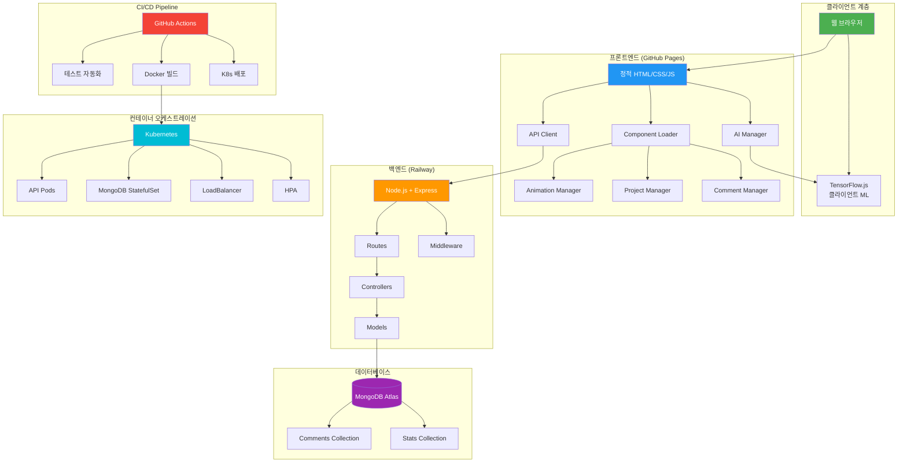
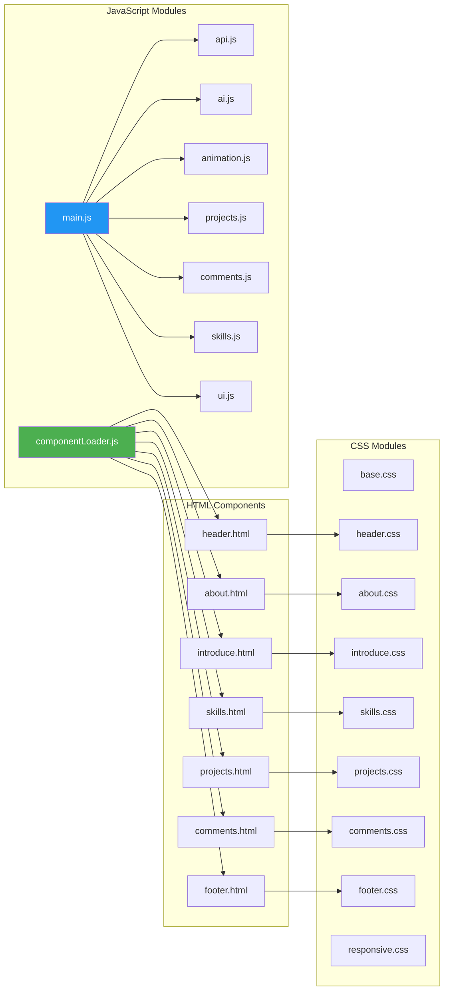
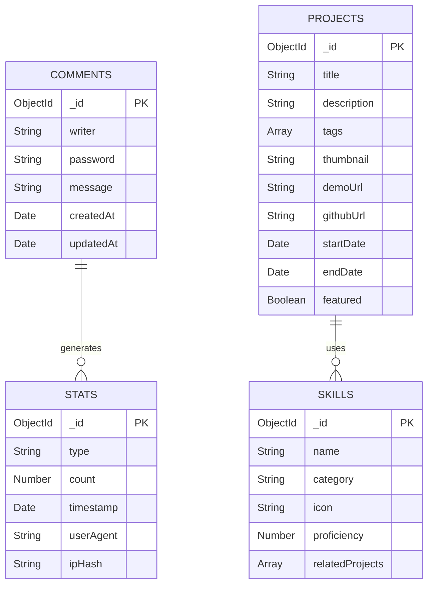
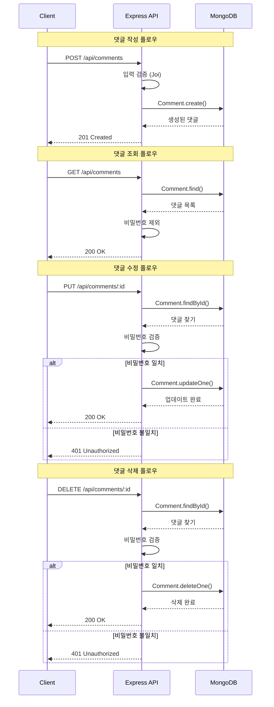
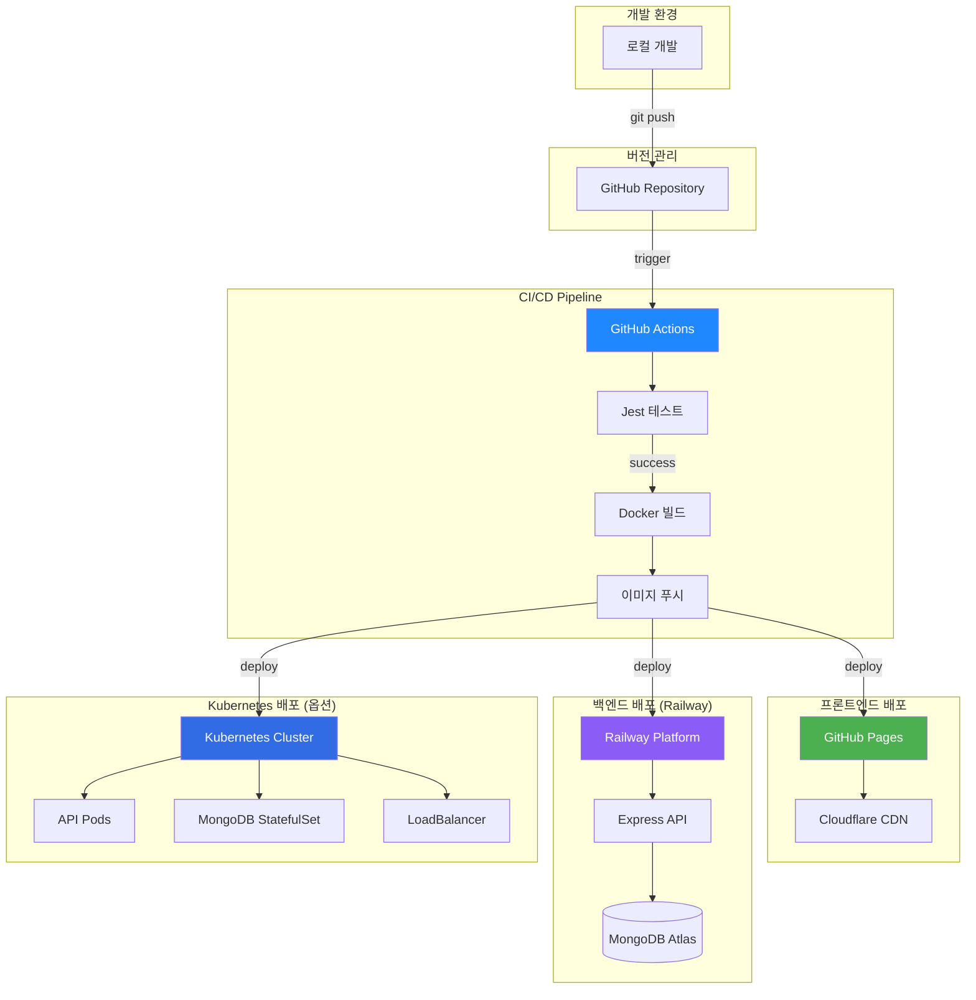
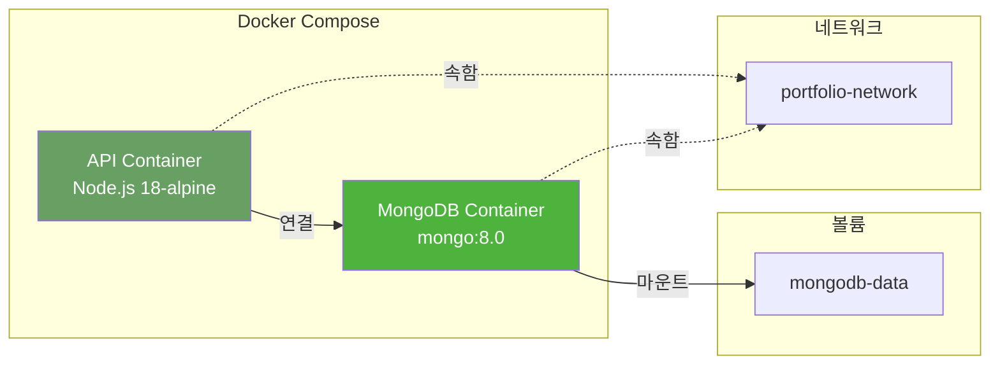
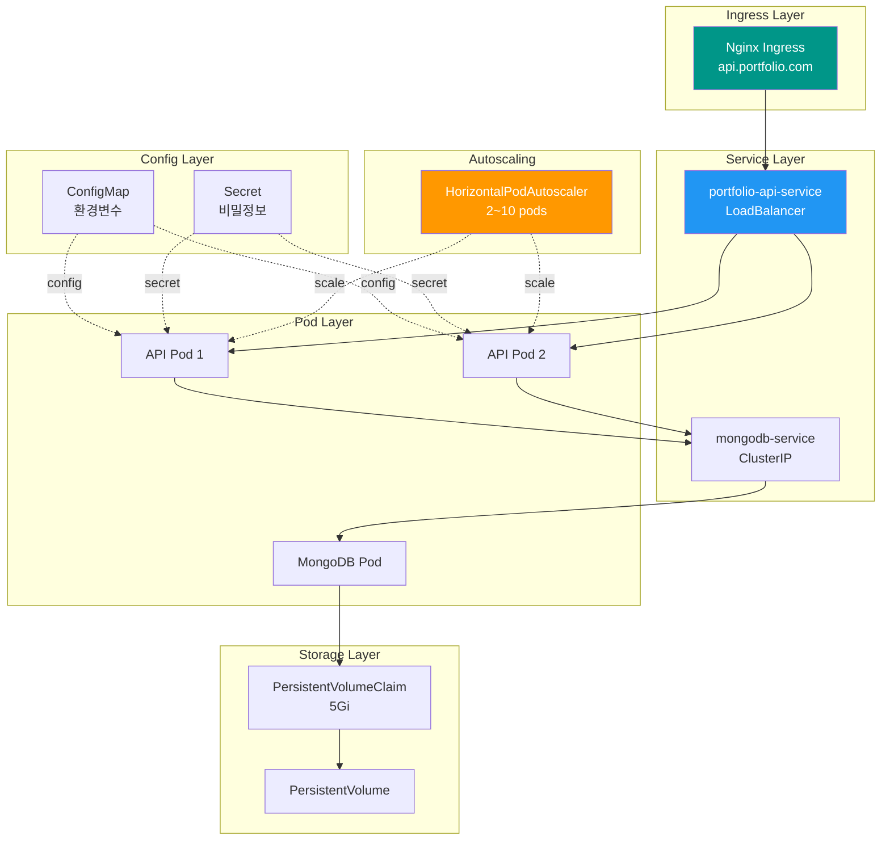

# 포트폴리오 프로젝트 아키텍처 문서

## 목차
1. [시스템 아키텍처](#시스템-아키텍처)
2. [데이터베이스 설계 (ERD)](#데이터베이스-설계-erd)
3. [기술 스택](#기술-스택)
4. [API 설계](#api-설계)
5. [배포 아키텍처](#배포-아키텍처)

---

## 시스템 아키텍처

### 전체 시스템 구조



### 프론트엔드 아키텍처



### 백엔드 아키텍처

```mermaid
graph TB
    subgraph "Express Server"
        A[server.js]
    end
    
    subgraph "Middleware Layer"
        M1[CORS]
        M2[Helmet]
        M3[Rate Limiter]
        M4[Morgan Logger]
        M5[Error Handler]
    end
    
    subgraph "Routes"
        R1[/api/comments]
        R2[/api/guestbook]
        R3[/api/projects]
        R4[/api/skills]
        R5[/api/stats]
    end
    
    subgraph "Controllers"
        CT1[Comment Controller]
        CT2[Guestbook Controller]
        CT3[Project Controller]
        CT4[Skill Controller]
        CT5[Stats Controller]
    end
    
    subgraph "Models"
        MD1[Comment Model]
        MD2[Validation]
    end
    
    subgraph "Database"
        DB[(MongoDB Atlas)]
    end
    
    A --> M1
    M1 --> M2
    M2 --> M3
    M3 --> M4
    M4 --> R1
    M4 --> R2
    M4 --> R3
    M4 --> R4
    M4 --> R5
    
    R1 --> CT1
    R2 --> CT2
    R3 --> CT3
    R4 --> CT4
    R5 --> CT5
    
    CT1 --> MD1
    CT2 --> MD1
    
    MD1 --> DB
    
    M5 -.오류 처리.-> CT1
    M5 -.오류 처리.-> CT2
    
    style A fill:#FF5722,color:#fff
    style DB fill:#4CAF50,color:#fff
```

---

## 데이터베이스 설계 (ERD)

### MongoDB Collections



### Comment 스키마 상세

```javascript
{
  _id: ObjectId,
  writer: {
    type: String,
    required: true,
    minlength: 2,
    maxlength: 20,
    trim: true
  },
  password: {
    type: String,
    required: true,
    minlength: 4,
    select: false  // 조회 시 제외
  },
  message: {
    type: String,
    required: true,
    minlength: 1,
    maxlength: 500,
    trim: true
  },
  createdAt: {
    type: Date,
    default: Date.now,
    index: true
  },
  updatedAt: {
    type: Date,
    default: Date.now
  }
}
```

### Stats 스키마 상세

```javascript
{
  _id: ObjectId,
  type: {
    type: String,
    enum: ['visit', 'click', 'comment', 'project_view'],
    required: true
  },
  count: {
    type: Number,
    default: 1
  },
  timestamp: {
    type: Date,
    default: Date.now,
    index: true
  },
  userAgent: String,
  ipHash: String,
  metadata: {
    type: Map,
    of: Schema.Types.Mixed
  }
}
```

---

## 기술 스택

### 프론트엔드
- **HTML5**: 시맨틱 마크업
- **CSS3**: Flexbox, Grid, Animations
- **JavaScript (ES6+)**: Modules, Async/Await
- **TensorFlow.js 4.15.0**: 클라이언트 측 ML
- **jQuery 3.6.0**: DOM 조작
- **GSAP 3.9.1**: 애니메이션
- **BOM/DOM API**: 브라우저 상호작용

### 백엔드
- **Node.js 18+**: JavaScript 런타임
- **Express 4.18**: 웹 프레임워크
- **MongoDB 8.0**: NoSQL 데이터베이스
- **Mongoose 8.0**: ODM
- **Joi**: 입력 검증
- **Helmet**: 보안 헤더
- **CORS**: Cross-Origin 설정
- **Morgan**: HTTP 로깅

### DevOps & 배포
- **Docker**: 컨테이너화
- **Kubernetes**: 오케스트레이션
- **GitHub Actions**: CI/CD
- **Railway**: PaaS 배포
- **GitHub Pages**: 정적 호스팅
- **MongoDB Atlas**: 클라우드 DB

### 테스트
- **Jest 29.7**: 테스트 프레임워크
- **Supertest 6.3**: HTTP 테스트
- **Coverage**: 70% 이상

---

## API 설계

### REST API 엔드포인트



### API 명세

#### 1. 댓글 작성
```http
POST /api/comments
Content-Type: application/json

{
  "writer": "김규진",
  "password": "1234",
  "message": "좋은 포트폴리오네요!"
}

Response: 201 Created
{
  "success": true,
  "data": {
    "_id": "...",
    "writer": "김규진",
    "message": "좋은 포트폴리오네요!",
    "createdAt": "2025-12-02T12:00:00Z"
  }
}
```

#### 2. 댓글 조회
```http
GET /api/comments

Response: 200 OK
{
  "success": true,
  "data": [
    {
      "_id": "...",
      "writer": "김규진",
      "message": "좋은 포트폴리오네요!",
      "createdAt": "2025-12-02T12:00:00Z"
    }
  ]
}
```

#### 3. 댓글 수정
```http
PUT /api/comments/:id
Content-Type: application/json

{
  "password": "1234",
  "message": "수정된 메시지"
}

Response: 200 OK
{
  "success": true,
  "data": {
    "_id": "...",
    "message": "수정된 메시지",
    "updatedAt": "2025-12-02T12:10:00Z"
  }
}
```

#### 4. 댓글 삭제
```http
DELETE /api/comments/:id
Content-Type: application/json

{
  "password": "1234"
}

Response: 200 OK
{
  "success": true,
  "message": "댓글이 삭제되었습니다."
}
```

#### 5. 방문 통계 기록
```http
POST /api/stats/visit

Response: 200 OK
{
  "success": true,
  "message": "방문 기록 완료"
}
```

---

## 배포 아키텍처

### GitHub Pages + Railway 하이브리드 배포



### Docker 컨테이너 구조



### Kubernetes 배포 구조



---

## 성능 최적화

### 프론트엔드 최적화
- ✅ 컴포넌트 동적 로딩
- ✅ CSS/JS 파일 분리 (캐싱 최적화)
- ✅ GSAP를 통한 하드웨어 가속 애니메이션
- ✅ Lazy Loading (이미지, 프로젝트)
- ✅ 클라이언트 사이드 ML (TensorFlow.js)

### 백엔드 최적화
- ✅ MongoDB 인덱싱 (createdAt)
- ✅ Rate Limiting (DDoS 방지)
- ✅ CORS 정책
- ✅ Helmet 보안 헤더
- ✅ 비밀번호 선택적 조회 (`select: false`)

### 배포 최적화
- ✅ Docker 멀티 스테이지 빌드
- ✅ Alpine Linux (경량 이미지)
- ✅ Kubernetes HPA (자동 스케일링)
- ✅ LoadBalancer (트래픽 분산)
- ✅ PersistentVolume (데이터 영속성)

---

## 보안

### 구현된 보안 기능
1. **Helmet**: HTTP 보안 헤더 자동 설정
2. **CORS**: 특정 도메인만 API 접근 허용
3. **Rate Limiting**: IP별 요청 제한
4. **입력 검증**: Joi를 통한 엄격한 검증
5. **비밀번호 보호**: `select: false`로 조회 차단
6. **XSS 방어**: 입력 sanitization
7. **Kubernetes Secret**: 민감 정보 암호화
8. **HTTPS**: TLS/SSL 인증서 적용 가능

---

## 모니터링 & 로깅

### 로깅
- **Morgan**: HTTP 요청 로깅
- **Console**: 개발 환경 디버깅
- **Kubernetes Logs**: `kubectl logs`로 추적

### 헬스체크
```javascript
// 서버 상태 확인
GET /health

Response:
{
  "status": "ok",
  "timestamp": "2025-12-02T12:00:00Z",
  "uptime": 3600,
  "database": "connected"
}
```

---

## 확장 가능성

### 향후 개선 사항
- [ ] Redis 캐싱 레이어 추가
- [ ] WebSocket 실시간 댓글
- [ ] Elasticsearch 전문 검색
- [ ] Prometheus + Grafana 모니터링
- [ ] ELK Stack 로그 분석
- [ ] CDN 통합 (Cloudflare)
- [ ] PWA 전환
- [ ] GraphQL API

---

## 참고 자료
- [Express.js 공식 문서](https://expressjs.com/)
- [MongoDB 공식 문서](https://www.mongodb.com/docs/)
- [Kubernetes 공식 문서](https://kubernetes.io/docs/)
- [TensorFlow.js 가이드](https://www.tensorflow.org/js)
- [GitHub Actions 문서](https://docs.github.com/actions)
- [Docker 베스트 프랙티스](https://docs.docker.com/develop/dev-best-practices/)
