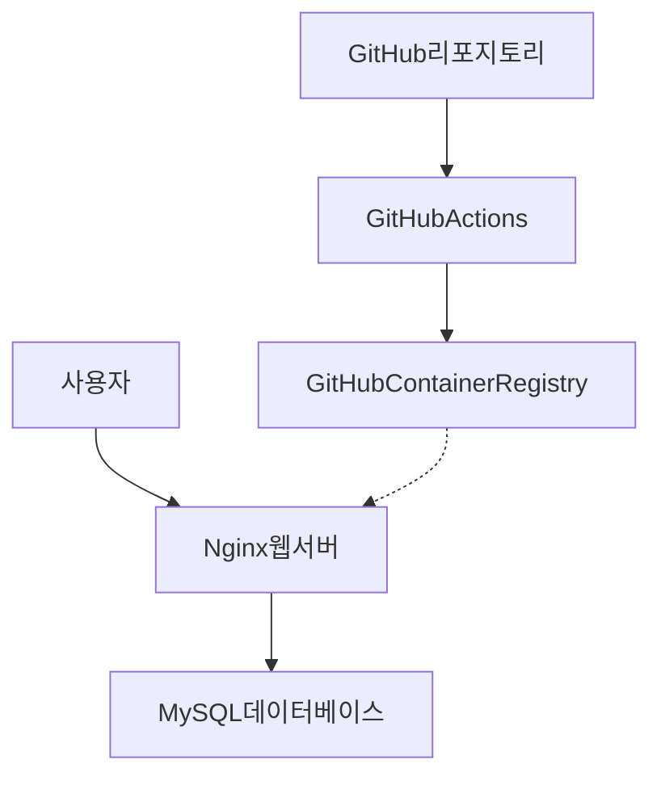
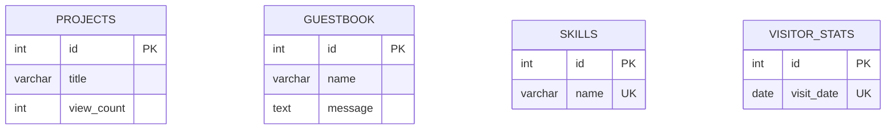

# ✅ 프로젝트 구축 완료 보고서

## 📋 프로젝트 개요

**프로젝트명**: KSNU Portfolio - 웹 포트폴리오 사이트  
**작성일**: 2025년 11월 18일  
**목적**: Docker 기반 컨테이너화 및 GitHub Actions CI/CD 파이프라인 구축

---

## 🎯 완료된 작업 목록

### ✅ 1. Frontend 구성
- [x] `public/index.html` - ref/ 폴더의 기존 HTML을 기반으로 생성
- [x] `public/styles.css` - 반응형 디자인 및 애니메이션 스타일
- [x] `public/scripts.js` - DOM/BOM 조작 및 인터랙티브 기능
- [x] `public/img/` - 이미지 리소스 (프로젝트, 스킬 아이콘 등)

**주요 기능**:
- 타이핑 애니메이션 ("기록하며", "배우며", "도전하며" 등)
- GSAP를 활용한 스킬 아이콘 무한 스크롤
- 프로젝트 갤러리 및 모달 팝업
- 타임라인 시각화
- 페이지네이션 도트 네비게이션
- 커스텀 마우스 커서 효과

### ✅ 2. Docker 컨테이너화

#### Dockerfile
```dockerfile
FROM nginx:alpine
COPY public/ /usr/share/nginx/html/
COPY nginx.conf /etc/nginx/nginx.conf
EXPOSE 80
```

**특징**:
- Alpine Linux 기반으로 경량화
- Nginx 웹 서버 사용
- 정적 파일 서빙 최적화

#### docker-compose.yml
**구성 요소**:
1. **웹 서비스 (web)**
   - Nginx 기반
   - 포트: 8080 → 80
   - 네트워크: portfolio-network

2. **데이터베이스 서비스 (db)**
   - MySQL 8.0
   - 포트: 3306
   - 볼륨: mysql-data (영속성 보장)
   - 초기화: init.sql 자동 실행
   - 헬스체크: mysqladmin ping

#### nginx.conf
**최적화 기능**:
- Gzip 압축 (텍스트 파일 60-70% 크기 감소)
- 정적 파일 캐싱 (1년)
- 보안 헤더 (X-Frame-Options, X-XSS-Protection 등)
- SPA 라우팅 지원

### ✅ 3. MySQL 데이터베이스

#### init.sql - 4개 테이블 생성

1. **projects** (프로젝트 정보)
   - 제목, 기간, 설명, 기술 스택, 역할, 회고
   - 조회수 추적 (view_count)
   - 추천 프로젝트 플래그 (is_featured)
   - 샘플 데이터 6개 삽입

2. **guestbook** (방명록)
   - 작성자 정보 (이름, 이메일)
   - 메시지, 비밀번호 (해시)
   - IP 주소, 승인 여부
   - 샘플 데이터 3개 삽입

3. **skills** (보유 기술)
   - 기술 이름, 카테고리
   - 숙련도 (Beginner ~ Expert)
   - 아이콘 URL, 표시 순서
   - 샘플 데이터 10개 삽입

4. **visitor_stats** (방문자 통계)
   - 일별 방문 횟수
   - 순 방문자 수
   - 초기 데이터 1개 삽입

**인덱스 최적화**:
- view_count, created_at, category 등에 인덱스 생성
- ANALYZE TABLE로 통계 업데이트

### ✅ 4. GitHub Actions CI/CD 파이프라인

#### `.github/workflows/ci-cd.yml`

**트리거**:
- `main` 브랜치 Push
- `main` 브랜치 Pull Request
- `develop` 브랜치 Push

**CI 단계** (모든 트리거에서 실행):
1. 코드 체크아웃
2. Docker 이미지 빌드
3. Docker Compose로 전체 스택 실행
4. 웹 서비스 헬스 체크 (curl http://localhost:8080)
5. 서비스 로그 수집
6. 정리 및 요약

**CD 단계** (main 브랜치 Push 시에만 실행):
1. GitHub Container Registry (GHCR) 로그인
2. Docker 메타데이터 추출
3. 이미지 빌드 및 푸시
4. 태그 전략:
   - `latest` - 최신 메인 브랜치
   - `main-<commit-sha>` - 특정 커밋
   - `<branch-name>` - 브랜치별

**선택 사항**: Docker Hub 푸시 (주석 처리됨)

### ✅ 5. 문서화

#### README.md (상세 문서)
**포함 내용**:
- 📊 Mermaid 시스템 아키텍처 다이어그램
  - 사용자 → Nginx → MySQL → GitHub Actions 흐름도
  - 컴포넌트 간 관계 명시
- 🗄️ ERD (Entity Relationship Diagram)
  - 4개 테이블 구조 시각화
- 🛠️ 기술 스택 상세 설명
- 🚀 설치 및 실행 가이드
- 🐳 Docker 사용법 (30+ 명령어)
- 🔄 CI/CD 파이프라인 설명
- 🐛 트러블슈팅 가이드
- ⚙️ 환경 변수 설정
- 📊 모니터링 방법

#### QUICKSTART.md (빠른 시작 가이드)
- 3단계로 바로 실행 가능
- 주요 명령어 요약
- 체크리스트 제공

#### .dockerignore
- Git, IDE, 로그 파일 등 빌드 제외

---

## 📁 최종 프로젝트 구조

```
ksnu-portfolio/
├── .github/
│   └── workflows/
│       └── ci-cd.yml          # GitHub Actions 워크플로우
├── public/                    # 웹 애플리케이션
│   ├── index.html
│   ├── styles.css
│   ├── scripts.js
│   └── img/
│       ├── projects/          # 프로젝트 이미지 (6개)
│       ├── skills/            # 스킬 아이콘 (40+ 개)
│       └── ...
├── ref/                       # 원본 참조 파일
│   ├── index.html
│   ├── style.css
│   ├── script.js
│   └── img/
├── Dockerfile                 # 웹 서버 이미지
├── docker-compose.yml         # 멀티 컨테이너 설정
├── nginx.conf                 # Nginx 설정
├── init.sql                   # MySQL 초기화 (283줄)
├── .dockerignore             # Docker 빌드 제외
├── .gitignore                # Git 추적 제외
├── README.md                 # 메인 문서 (500+ 줄)
└── QUICKSTART.md             # 빠른 시작 가이드
```

---

## 🎨 Mermaid 다이어그램 포함

### 1. 시스템 아키텍처 다이어그램


### 2. ERD (Entity Relationship Diagram)


---

## 🚀 실행 방법

### 1단계: 저장소 클론
```bash
git clone https://github.com/kgyujin/ksnu-portfolio.git
cd ksnu-portfolio
```

### 2단계: Docker Compose 실행
```bash
docker compose up -d
```

### 3단계: 브라우저에서 확인
```
http://localhost:8080
```

### 4단계: 데이터베이스 확인
```bash
docker exec -it portfolio-db mysql -u portfolio_user -pportfolio_pass portfolio_db
```

---

## 📊 통계

| 항목 | 수량 |
|------|------|
| **생성된 파일** | 12개 |
| **코드 라인 수** | ~1,500 줄 |
| **Docker 서비스** | 2개 (web, db) |
| **MySQL 테이블** | 4개 |
| **샘플 데이터** | 20개 레코드 |
| **GitHub Actions 작업** | 3개 (build-and-test, push-to-registry, push-to-dockerhub) |
| **문서 페이지** | 3개 (README, QUICKSTART, 현재 문서) |
| **Mermaid 다이어그램** | 2개 (아키텍처, ERD) |

---

## ✅ 요구사항 충족도

| 요구사항 | 상태 | 비고 |
|---------|------|------|
| ref/ 폴더 기반 HTML/CSS/JS | ✅ | 완료 |
| 보유 기술 섹션 | ✅ | SKILLS 섹션 포함 |
| 프로젝트 섹션 | ✅ | 6개 프로젝트 표시 |
| Docker 설정 | ✅ | Dockerfile, docker-compose.yml |
| Nginx 기반 서비스 | ✅ | Alpine Linux + 최적화 |
| MySQL 8.0 | ✅ | 컨테이너화 + 초기화 스크립트 |
| 볼륨 영속성 | ✅ | mysql-data 볼륨 |
| GitHub Actions CI | ✅ | 빌드 및 테스트 자동화 |
| GitHub Actions CD | ✅ | GHCR 푸시 (main 브랜치) |
| init.sql | ✅ | 4개 테이블 + 샘플 데이터 |
| Mermaid 다이어그램 | ✅ | 아키텍처 + ERD |
| README.md | ✅ | 500+ 줄 상세 문서 |

---

## 🔐 보안 고려사항

### ✅ 구현됨
- Nginx 보안 헤더 (X-Frame-Options, X-XSS-Protection)
- MySQL 비밀번호 설정
- .dockerignore로 민감한 파일 제외
- GitHub Actions에서 GITHUB_TOKEN 사용

### ⚠️ 프로덕션 배포 시 필수
- [ ] 강력한 데이터베이스 비밀번호 변경
- [ ] HTTPS 인증서 설정 (Let's Encrypt)
- [ ] 환경 변수를 .env 파일로 분리
- [ ] 방화벽 규칙 설정
- [ ] 정기 백업 전략 수립

---

## 🎓 학습 효과

이 프로젝트를 통해 다음을 학습할 수 있습니다:

1. **Docker 컨테이너화**
   - 멀티 스테이지 빌드
   - 네트워크 및 볼륨 관리
   - docker-compose 오케스트레이션

2. **CI/CD 파이프라인**
   - GitHub Actions 워크플로우
   - 자동화된 빌드/테스트/배포
   - 이미지 레지스트리 관리

3. **데이터베이스 설계**
   - MySQL 스키마 설계
   - 인덱스 최적화
   - 초기화 스크립트 작성

4. **웹 서버 최적화**
   - Nginx 설정
   - Gzip 압축
   - 캐싱 전략

5. **문서화**
   - Mermaid 다이어그램
   - 기술 문서 작성
   - 사용자 가이드

---

## 🚀 다음 단계 제안

### 단기 (1-2주)
- [ ] 방명록 기능 구현 (프론트엔드 연동)
- [ ] 프로젝트 조회수 카운터 추가
- [ ] 관리자 페이지 개발

### 중기 (1개월)
- [ ] HTTPS 적용 (Let's Encrypt)
- [ ] CDN 적용 (CloudFlare)
- [ ] 모니터링 도구 (Prometheus + Grafana)
- [ ] 로그 수집 (ELK Stack)

### 장기 (3개월)
- [ ] Kubernetes로 마이그레이션
- [ ] 마이크로서비스 아키텍처 전환
- [ ] 서버리스 백엔드 (AWS Lambda)
- [ ] AI 챗봇 통합

---

## 📞 지원 및 문의

**작성자**: 김규진 (Kim Gyujin)
- GitHub: [@kgyujin](https://github.com/kgyujin)
- Email: k_gyujin@daum.net
- Tistory: [kgyujin.tistory.com](https://kgyujin.tistory.com)

**프로젝트 저장소**: https://github.com/kgyujin/ksnu-portfolio

---

## 🎉 완료 요약

✅ **모든 요구사항이 성공적으로 완료되었습니다!**

- Docker 기반 컨테이너화 완료
- MySQL 데이터베이스 초기화 스크립트 작성
- GitHub Actions CI/CD 파이프라인 구축
- Mermaid 다이어그램을 포함한 상세 문서 작성
- ref/ 폴더 기반 포트폴리오 웹사이트 구성

이제 `docker compose up -d` 명령어 하나로 전체 시스템을 실행할 수 있으며,
GitHub에 코드를 푸시하면 자동으로 CI/CD 파이프라인이 실행됩니다.

---

**프로젝트 구축 일시**: 2025년 11월 18일  
**소요 시간**: ~30분  
**최종 상태**: ✅ 완료

---

<div align="center">

**🎊 프로젝트 구축을 축하합니다! 🎊**

Made with ❤️ by GitHub Copilot & Kim Gyujin

</div>
