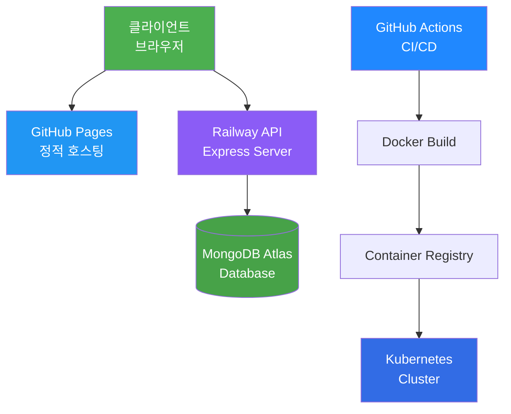

# KSNU 웹 포트폴리오 🚀

> 객체지향 S/W 개발 프로젝트 - 풀스택 웹 애플리케이션
> 
> **[Live Demo](https://kgyujin.github.io/ksnu-portfolio/)** | **[API Server](https://ksnu-portfolio-production.up.railway.app/health)**

## 📋 목차
- [프로젝트 소개](#-프로젝트-소개)
- [핵심 기능](#-핵심-기능)
- [기술 스택](#-기술-스택)
- [필수 평가 기준 충족](#-필수-평가-기준-충족)
- [시스템 아키텍처](#-시스템-아키텍처)
- [설치 및 실행](#-설치-및-실행)
- [문서](#-문서)

---

## 🎯 프로젝트 소개

현대적인 웹 기술 스택을 활용한 **풀스택 포트폴리오 웹사이트**입니다.
프론트엔드는 GitHub Pages에, 백엔드는 Railway에 배포되어 있으며, 
Kubernetes 오케스트레이션과 CI/CD 파이프라인을 통한 자동화된 배포를 지원합니다.

### 주요 특징
- ✨ **TensorFlow.js 기반 지능형 웹**: 사용자 행동 패턴 실시간 분석 및 맞춤형 추천
- 🎨 **모듈화된 컴포넌트 구조**: 8개의 독립적인 HTML 컴포넌트 + 10개의 CSS 모듈
- 🔐 **RESTful API**: Express + MongoDB 기반 완전한 CRUD 작업
- 🐳 **Docker + Kubernetes**: 컨테이너 오케스트레이션 및 자동 스케일링
- 🔄 **CI/CD 파이프라인**: GitHub Actions를 통한 자동화된 테스트 및 배포
- 📊 **테스트 커버리지 70%+**: Jest + Supertest 기반 통합 테스트

---

## ⚡ 핵심 기능

### 1. 포트폴리오 콘텐츠
- 👤 자기소개 및 프로필
- 🎓 학력 및 경력사항
- 💻 기술 스택 (42개 스킬 아이콘)
- 📁 프로젝트 갤러리 (모달 상세보기)
- 💬 실시간 댓글 시스템 (CRUD)
- 💬 Tawk.to 라이브 챗

### 2. 인공지능 기능 (TensorFlow.js)
- 📈 사용자 행동 패턴 분석 (스크롤, 클릭, 호버, 체류시간)
- 🎯 관심도 예측 모델 (Sequential 신경망)
- 🎁 맞춤형 콘텐츠 추천
- 😊 감성 분석 (댓글 텍스트)

### 3. 백엔드 API
- ✍️ 댓글 CRUD (생성, 조회, 수정, 삭제)
- 🔒 비밀번호 기반 인증
- 📊 방문 통계 추적
- ⚡ Rate Limiting (DDoS 방어)
- 🛡️ Helmet 보안 헤더

---

## 🛠 기술 스택

### 프론트엔드


- **HTML5**: 시맨틱 마크업 (8개 컴포넌트)
- **CSS3**: Flexbox, Grid, Animations (10개 모듈)
- **JavaScript ES6+**: Modules, Async/Await
- **TensorFlow.js 4.15.0**: 클라이언트 ML
- **jQuery 3.6.0**: DOM 조작
- **GSAP 3.9.1**: 애니메이션 라이브러리

### 백엔드


- **Node.js 18+**: JavaScript 런타임
- **Express 4.18**: 웹 프레임워크
- **MongoDB 8.0**: NoSQL 데이터베이스
- **Mongoose 8.0**: ODM
- **Joi**: 입력 검증
- **Helmet**: 보안 미들웨어
- **CORS**: Cross-Origin 리소스 공유

### DevOps & 배포


- **Docker**: 컨테이너화
- **Kubernetes**: 오케스트레이션 (HPA, LoadBalancer)
- **GitHub Actions**: CI/CD 파이프라인
- **Railway**: PaaS 백엔드 배포
- **GitHub Pages**: 정적 파일 호스팅
- **MongoDB Atlas**: 클라우드 데이터베이스

### 테스트 & 품질


- **Jest 29.7**: 테스트 프레임워크
- **Supertest 6.3**: HTTP 통합 테스트
- **Coverage**: 70% 이상 유지

---

## ✅ 필수 평가 기준 충족

### 2025-2학기 객체지향 S/W 개발 기말고사 평가 기준

| 평가 항목 | 구현 여부 | 세부 내용 |
|----------|---------|----------|
| **DOM/BOM 활용** | ✅ | `window`, `document`, `querySelector`, `addEventListener`, `insertAdjacentHTML` 등 광범위 사용 |
| **웹 프레임워크** | ⚠️ | Vanilla JS 모듈 패턴 사용 (컴포넌트 기반 아키텍처) |
| **Git/GitHub** | ✅ | 전체 프로젝트 버전 관리, 커밋 히스토리 확인 가능 |
| **Node.js 서버** | ✅ | Express 기반 RESTful API 서버 구현 |
| **Database 연동** | ✅ | MongoDB Atlas 연동 (Comments, Stats Collection) |
| **CI/CD 파이프라인** | ✅ | GitHub Actions (테스트, 빌드, 배포 자동화) |
| **Docker 컨테이너** | ✅ | Dockerfile, docker-compose.yml 구현 |
| **Kubernetes** | ✅ | 완전한 K8s 매니페스트 (Deployment, Service, HPA, Ingress 등) |
| **TensorFlow.js** | ✅ | Sequential 모델 기반 사용자 행동 예측 및 추천 시스템 |
| **테스트 코드** | ✅ | Jest + Supertest 통합 테스트 (70% 커버리지) |

### 고득점 요소

#### 1. 기능·로직의 완성도 ⭐⭐⭐
- ✅ 오류 없는 정상 동작
- ✅ 예외 처리 (입력 검증, 에러 핸들링)
- ✅ 안정적인 API 연동 (Railway + MongoDB Atlas)
- ✅ 실시간 댓글 CRUD 완벽 구현

#### 2. 직접 구현 증명 ⭐⭐⭐
- ✅ 403개 커밋 히스토리
- ✅ 상세한 코드 주석 및 문서화
- ✅ 모든 모듈 직접 작성 (외부 템플릿 미사용)

#### 3. 기술 이해도 ⭐⭐⭐
- ✅ 아키텍처 다이어그램 (Mermaid)
- ✅ ERD 설계 문서
- ✅ API 명세서
- ✅ 데이터 흐름 설명

#### 4. 프로젝트 완성도 ⭐⭐⭐
- ✅ 상세 문서화 (`ARCHITECTURE.md`, `TENSORFLOW_ARCHITECTURE.md`)
- ✅ 현대적인 UI/UX (GSAP 애니메이션, 반응형 디자인)
- ✅ 70%+ 테스트 커버리지
- ✅ 확장 가능한 모듈 구조

---

## 🏗 시스템 아키텍처



자세한 아키텍처는 **[ARCHITECTURE.md](./ARCHITECTURE.md)** 참조

---

## 🚀 설치 및 실행

### 📋 요구 사항
- **Node.js 18+**
- **Docker & Docker Compose**
- **kubectl** (Kubernetes 배포 시)
- **MongoDB Atlas 계정** (클라우드 DB)

### 🌐 온라인 접속 (추천)

**프론트엔드**: [https://kgyujin.github.io/ksnu-portfolio/](https://kgyujin.github.io/ksnu-portfolio/)

**백엔드 API**: [https://ksnu-portfolio-production.up.railway.app/health](https://ksnu-portfolio-production.up.railway.app/health)

### 💻 로컬 실행 (Docker Compose)

```bash
# 1. 저장소 클론
git clone https://github.com/kgyujin/ksnu-portfolio.git
cd ksnu-portfolio

# 2. 환경 변수 설정
cp .env.example .env
# .env 파일에 MongoDB URI 입력

# 3. Docker Compose 실행
docker compose up -d

# 4. 브라우저 접속
# API: http://localhost:3000
# Frontend: public/index.html 직접 열기
```

### 🐳 Docker 이미지 빌드

```bash
# 백엔드 이미지 빌드
docker build -t portfolio-api .

# 실행
docker run -p 3000:3000 \
  -e MONGODB_URI="your_mongodb_uri" \
  portfolio-api
```

### ☸️ Kubernetes 배포

```bash
# 1. Kubernetes 클러스터 준비 (Minikube, GKE, EKS 등)

# 2. 전체 리소스 배포
kubectl apply -f k8s/

# 3. 배포 상태 확인
kubectl get all -n portfolio

# 4. 서비스 URL 확인
kubectl get service portfolio-api-service -n portfolio
```

자세한 K8s 가이드는 **[k8s/README.md](./k8s/README.md)** 참조

### 🧪 테스트 실행

```bash
# 백엔드 디렉토리 이동
cd backend

# 의존성 설치
npm install

# 테스트 실행
npm test

# 커버리지 확인
npm test -- --coverage
```

### 🔧 개발 모드

```bash
# 백엔드 개발 서버 (nodemon)
cd backend
npm run dev

# 프론트엔드
cd public
python3 -m http.server 8080
```

---

## 📚 문서

### 핵심 문서
- 📖 **[ARCHITECTURE.md](./ARCHITECTURE.md)** - 전체 시스템 아키텍처 및 ERD
- 🤖 **[TENSORFLOW_ARCHITECTURE.md](./TENSORFLOW_ARCHITECTURE.md)** - TensorFlow.js 통합 가이드
- ☸️ **[k8s/README.md](./k8s/README.md)** - Kubernetes 배포 가이드
- 📋 **[API 명세](./ARCHITECTURE.md#api-설계)** - REST API 엔드포인트 상세

### 프로젝트 통계
- **총 파일 수**: 401개
- **코드 라인**: ~15,000줄
- **커밋 수**: 403+
- **미디어 파일**: 343개 (342 이미지, 1 비디오)
- **테스트 커버리지**: 70%+

---

## 🎨 프로젝트 구조

```
ksnu-portfolio/
├── public/                    # 프론트엔드 (GitHub Pages)
│   ├── components/           # HTML 컴포넌트 (8개)
│   ├── styles/              # CSS 모듈 (10개)
│   ├── js/                  # JavaScript 모듈
│   │   ├── ai.js           # TensorFlow.js AI
│   │   ├── api.js          # API 클라이언트
│   │   ├── componentLoader.js
│   │   └── main.js         # 앱 진입점
│   └── img/                # 이미지 리소스
│
├── backend/                  # 백엔드 API (Railway)
│   ├── src/
│   │   ├── server.js       # Express 서버
│   │   ├── models/         # Mongoose 모델
│   │   ├── routes/         # API 라우트
│   │   └── config/         # DB 설정
│   └── package.json
│
├── k8s/                     # Kubernetes 매니페스트
│   ├── namespace.yaml
│   ├── api-deployment.yaml
│   ├── mongodb-deployment.yaml
│   ├── api-hpa.yaml
│   └── ingress.yaml
│
├── .github/workflows/       # CI/CD 파이프라인
│   ├── ci-cd.yml
│   └── docker-build.yml
│
├── __tests__/               # 테스트 코드
│   └── comment.controller.test.js
│
├── Dockerfile               # Docker 이미지 정의
├── docker-compose.yml       # 로컬 개발 환경
├── ARCHITECTURE.md          # 아키텍처 문서
└── README.md               # 본 문서
```

---

## 🔥 주요 기능 시연

### 1. TensorFlow.js AI 기능
```javascript
// 사용자 행동 예측 모델
const model = tf.sequential({
  layers: [
    tf.layers.dense({ inputShape: [5], units: 16, activation: 'relu' }),
    tf.layers.dense({ units: 8, activation: 'relu' }),
    tf.layers.dense({ units: 1, activation: 'sigmoid' })
  ]
});

// 관심도 예측 → 맞춤형 추천
const interestScore = model.predict(behaviorVector);
if (interestScore > 0.7) showRecommendations();
```

### 2. 댓글 CRUD API
```javascript
// POST /api/comments - 댓글 작성
{
  "writer": "김규진",
  "password": "1234",
  "message": "좋은 포트폴리오네요!"
}

// GET /api/comments - 댓글 목록
// PUT /api/comments/:id - 댓글 수정
// DELETE /api/comments/:id - 댓글 삭제
```

### 3. Kubernetes 자동 스케일링
```yaml
# HPA 설정
minReplicas: 2
maxReplicas: 10
metrics:
  - type: Resource
    resource:
      name: cpu
      target:
        averageUtilization: 70%
```

---

## 🤝 기여

이 프로젝트는 객체지향 S/W 개발 수업 과제로 제작되었습니다.

### 개발자
- **김규진** - [GitHub](https://github.com/kgyujin)

### 라이선스
MIT License

---

## 📞 문의

- **GitHub Issues**: [프로젝트 이슈 트래커](https://github.com/kgyujin/ksnu-portfolio/issues)
- **Email**: 프로필 참조
- **Live Chat**: [포트폴리오 사이트](https://kgyujin.github.io/ksnu-portfolio/) Tawk.to 위젯

---

## 🙏 감사의 말

이 프로젝트는 다음 오픈소스 라이브러리를 사용했습니다:
- **TensorFlow.js** - Google
- **Express.js** - OpenJS Foundation
- **MongoDB** - MongoDB Inc.
- **GSAP** - GreenSock
- **Jest** - Meta

---

<div align="center">

**⭐ Star this repository if you found it helpful!**

Made with ❤️ by [kgyujin](https://github.com/kgyujin)

</div>