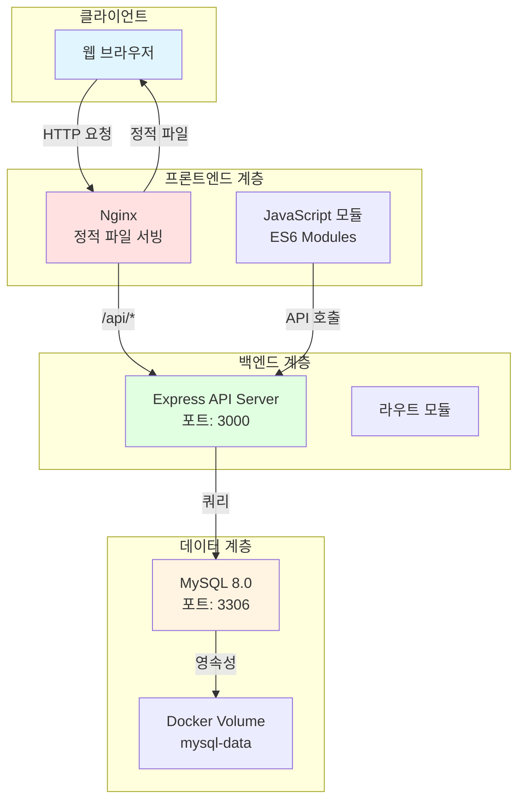

# 🎨 KSNU Portfolio - 모듈화된 웹 포트폴리오


군산대학교 소프트웨어학부 김규진의 **모듈화된** 웹 포트폴리오 사이트입니다. 

## 🎯 주요 특징

- ✅ **완전 모듈화된 구조**: 프론트엔드와 백엔드 분리
- ✅ **RESTful API**: Node.js + Express 기반 백엔드
- ✅ **ES6 모듈**: JavaScript 코드의 모듈화 및 재사용성 향상
- ✅ **Docker 컨테이너화**: 3-tier 아키텍처 (Web + API + DB)
- ✅ **환경 변수 관리**: .env 파일을 통한 설정 관리
- ✅ **CI/CD 파이프라인**: GitHub Actions 자동화

## 📋 목차

- [프로젝트 구조](#-프로젝트-구조)
- [시스템 아키텍처](#-시스템-아키텍처)
- [기술 스택](#-기술-스택)
- [빠른 시작](#-빠른-시작)
- [API 문서](#-api-문서)
- [개발 가이드](#-개발-가이드)
- [환경 변수](#-환경-변수)

## 📁 프로젝트 구조

```
ksnu-portfolio/
├── backend/                    # 백엔드 API 서버
│   ├── src/
│   │   ├── server.js          # Express 서버 진입점
│   │   ├── config/
│   │   │   └── database.js    # MySQL 연결 풀
│   │   └── routes/            # API 라우트
│   │       ├── projects.js    # 프로젝트 API
│   │       ├── guestbook.js   # 방명록 API
│   │       ├── skills.js      # 스킬 API
│   │       └── stats.js       # 통계 API
│   ├── Dockerfile
│   ├── package.json
│   └── .dockerignore
├── public/                     # 프론트엔드
│   ├── js/                    # 모듈화된 JavaScript
│   │   ├── main.js           # 메인 진입점
│   │   ├── api.js            # API 클라이언트
│   │   ├── animation.js      # 애니메이션 관리
│   │   ├── projects.js       # 프로젝트 관리
│   │   ├── skills.js         # 스킬 관리
│   │   ├── ui.js             # UI 유틸리티
│   │   └── typing.js         # 타이핑 효과
│   ├── index.html
│   ├── styles.css
│   └── img/
├── .github/workflows/
│   └── ci-cd.yml
├── docker-compose.yml
├── Dockerfile
├── nginx.conf
├── init.sql
├── .env                       # 환경 변수 (gitignore)
├── .env.example              # 환경 변수 예제
└── README.md
```

## 🏗️ 시스템 아키텍처



## 🛠️ 기술 스택

### Frontend
- **HTML5 + CSS3**: 시맨틱 마크업, 반응형 디자인
- **JavaScript ES6+ Modules**: 모듈화된 코드 구조
- **GSAP**: 애니메이션 라이브러리
- **Fetch API**: 비동기 HTTP 통신

### Backend
- **Node.js 18+**: JavaScript 런타임
- **Express 4.x**: 웹 프레임워크
- **MySQL2**: MySQL 클라이언트
- **Joi**: 데이터 검증
- **Helmet**: 보안 헤더
- **CORS**: Cross-Origin Resource Sharing
- **Morgan**: HTTP 요청 로깅

### Infrastructure
- **Nginx**: 리버스 프록시 + 정적 파일 서버
- **MySQL 8.0**: 관계형 데이터베이스
- **Docker & Docker Compose**: 컨테이너 오케스트레이션
- **GitHub Actions**: CI/CD 자동화

## 🚀 빠른 시작

### 1. 저장소 클론

```bash
git clone https://github.com/kgyujin/ksnu-portfolio.git
cd ksnu-portfolio
```

### 2. 환경 변수 설정

```bash
# .env.example을 .env로 복사
cp .env.example .env

# 필요한 경우 .env 파일 수정
nano .env
```

### 3. Docker Compose로 실행

```bash
# 모든 서비스 시작
docker compose up -d

# 로그 확인
docker compose logs -f
```

### 4. 접속

- **웹사이트**: http://localhost:8080
- **API 서버**: http://localhost:3000
- **API Health Check**: http://localhost:3000/health

### 5. 서비스 중지

```bash
# 서비스 중지
docker compose down

# 데이터까지 삭제
docker compose down -v
```

## 📡 API 문서

### Projects (프로젝트)

| Method | Endpoint | 설명 |
|--------|----------|------|
| GET | `/api/projects` | 모든 프로젝트 조회 |
| GET | `/api/projects/:id` | 특정 프로젝트 조회 (조회수 증가) |
| GET | `/api/projects/featured/list` | 추천 프로젝트 조회 |
| POST | `/api/projects` | 프로젝트 생성 (관리자) |

### Guestbook (방명록)

| Method | Endpoint | 설명 |
|--------|----------|------|
| GET | `/api/guestbook` | 방명록 목록 조회 |
| POST | `/api/guestbook` | 방명록 작성 |
| DELETE | `/api/guestbook/:id` | 방명록 삭제 (비밀번호 필요) |

### Skills (스킬)

| Method | Endpoint | 설명 |
|--------|----------|------|
| GET | `/api/skills` | 모든 스킬 조회 |
| GET | `/api/skills?category={category}` | 카테고리별 스킬 조회 |
| GET | `/api/skills/grouped` | 카테고리별 그룹화된 스킬 |

### Stats (통계)

| Method | Endpoint | 설명 |
|--------|----------|------|
| POST | `/api/stats/visit` | 방문 기록 |
| GET | `/api/stats` | 방문자 통계 조회 |
| GET | `/api/stats/projects` | 프로젝트 조회수 통계 |

### API 사용 예시

```javascript
// 프로젝트 목록 조회
const response = await fetch('http://localhost:3000/api/projects');
const projects = await response.json();

// 방명록 작성
const response = await fetch('http://localhost:3000/api/guestbook', {
  method: 'POST',
  headers: { 'Content-Type': 'application/json' },
  body: JSON.stringify({
    name: '홍길동',
    email: 'hong@example.com',
    message: '멋진 포트폴리오네요!',
    password: '1234'
  })
});
```

## 💻 개발 가이드

### 로컬 개발 환경 설정

#### 1. 백엔드 개발

```bash
cd backend

# 의존성 설치
npm install

# 개발 모드 실행 (nodemon)
npm run dev

# 프로덕션 모드 실행
npm start
```

#### 2. 프론트엔드 개발

프론트엔드는 정적 파일이므로 별도의 빌드 과정이 필요 없습니다.

```bash
# 간단한 HTTP 서버로 테스트
cd public
python3 -m http.server 8000

# 또는 Node.js의 http-server 사용
npx http-server public -p 8000
```

#### 3. 데이터베이스 접속

```bash
# Docker 컨테이너 내부에서 MySQL 접속
docker exec -it portfolio-db mysql -u portfolio_user -pportfolio_pass portfolio_db

# 또는 로컬에서 MySQL 클라이언트 사용
mysql -h localhost -P 3306 -u portfolio_user -pportfolio_pass portfolio_db
```

### 코드 수정 후 재배포

```bash
# 특정 서비스만 재빌드
docker compose up -d --build web

# 모든 서비스 재빌드
docker compose up -d --build

# 캐시 없이 완전히 새로 빌드
docker compose build --no-cache
docker compose up -d
```

## ⚙️ 환경 변수

`.env` 파일에서 다음 환경 변수를 설정할 수 있습니다:

### 데이터베이스
```env
MYSQL_ROOT_PASSWORD=rootpassword
MYSQL_DATABASE=portfolio_db
MYSQL_USER=portfolio_user
MYSQL_PASSWORD=portfolio_pass
MYSQL_HOST=db
MYSQL_PORT=3306
```

### 백엔드 API
```env
API_PORT=3000
NODE_ENV=development  # development | production
```

### 프론트엔드
```env
WEB_PORT=8080
```

### CORS
```env
CORS_ORIGIN=http://localhost:8080
```

### 보안
```env
JWT_SECRET=your-secret-key-change-this-in-production
JWT_EXPIRES_IN=24h
```

## 🔒 보안 고려사항

### 구현된 보안 기능
- ✅ Helmet.js를 통한 HTTP 헤더 보안
- ✅ CORS 설정
- ✅ Rate Limiting (15분당 100 요청)
- ✅ SQL Injection 방지 (Parameterized Queries)
- ✅ XSS 방지 (Helmet CSP)
- ✅ 입력 검증 (Joi)

### 프로덕션 배포 시 필수 작업
- [ ] `.env` 파일의 모든 비밀번호 변경
- [ ] JWT_SECRET을 강력한 랜덤 문자열로 변경
- [ ] HTTPS 인증서 설정
- [ ] 데이터베이스 백업 전략 수립
- [ ] 모니터링 및 로깅 시스템 구축

## 🧪 테스트

### API 테스트

```bash
cd backend

# 테스트 실행
npm test

# 커버리지 확인
npm test -- --coverage
```

### 수동 테스트

```bash
# Health Check
curl http://localhost:3000/health

# 프로젝트 조회
curl http://localhost:3000/api/projects

# 방명록 작성
curl -X POST http://localhost:3000/api/guestbook \
  -H "Content-Type: application/json" \
  -d '{"name":"테스터","message":"테스트 메시지"}'
```

## 📊 모니터링

### 컨테이너 상태 확인

```bash
# 실행 중인 컨테이너
docker compose ps

# 리소스 사용량
docker stats

# 로그 확인
docker compose logs -f web
docker compose logs -f api
docker compose logs -f db
```

### API 헬스 체크

```bash
# 백엔드 API 상태
curl http://localhost:3000/health

# 응답 예시
{
  "status": "OK",
  "timestamp": "2025-11-18T02:00:00.000Z"
}
```

## 🐛 트러블슈팅

### 1. API 연결 오류

```bash
# API 컨테이너 로그 확인
docker compose logs api

# 네트워크 확인
docker network inspect ksnu-portfolio_portfolio-network
```

### 2. 데이터베이스 연결 실패

```bash
# DB 컨테이너 상태 확인
docker compose ps db

# DB 로그 확인
docker compose logs db

# 헬스 체크
docker exec portfolio-db mysqladmin ping -h localhost -u root -prootpassword
```

### 3. CORS 에러

`.env` 파일에서 `CORS_ORIGIN`을 확인하고 올바른 주소로 설정하세요.

```env
CORS_ORIGIN=http://localhost:8080
```

### 4. 모듈 로드 에러

브라우저 콘솔에서 JavaScript 모듈 로드 에러가 발생하면, `index.html`의 스크립트 태그가 `type="module"`로 설정되어 있는지 확인하세요.

## 📝 라이선스

이 프로젝트는 개인 포트폴리오 목적으로 제작되었습니다.

## 👤 저자

**김규진 (Kim Gyujin)**

- GitHub: [@kgyujin](https://github.com/kgyujin)
- Tistory: [kgyujin.tistory.com](https://kgyujin.tistory.com)
- Email: k_gyujin@daum.net

---

<div align="center">

**⭐ Star this repository if you find it helpful! ⭐**

Made with ❤️ by Kim Gyujin

</div>
