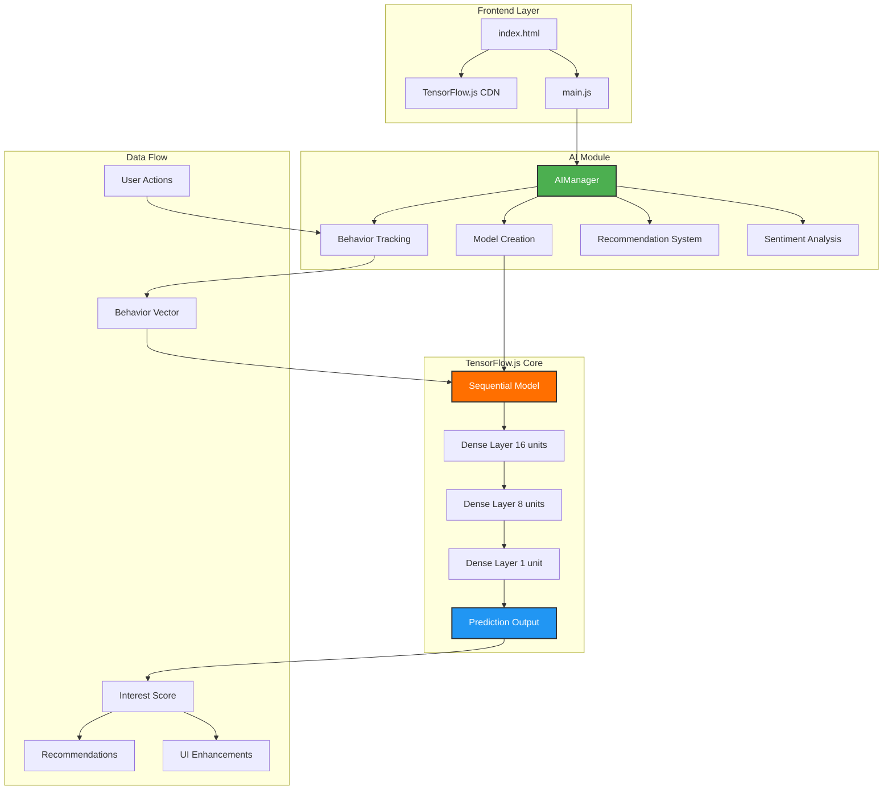
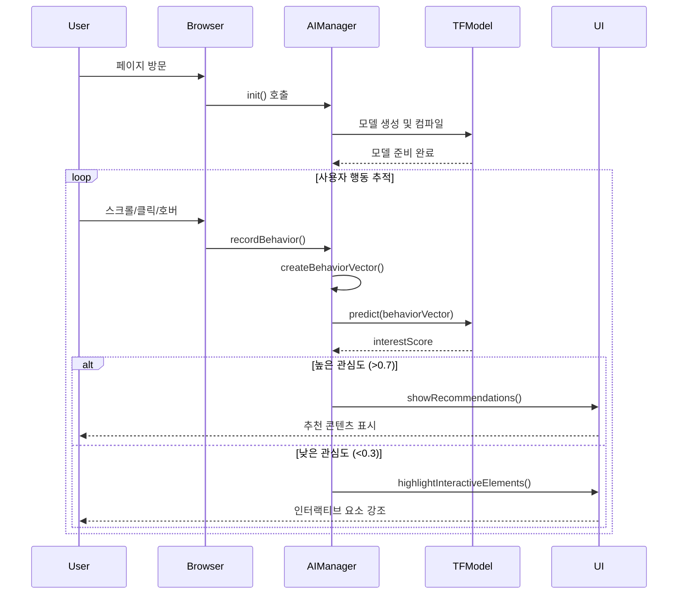
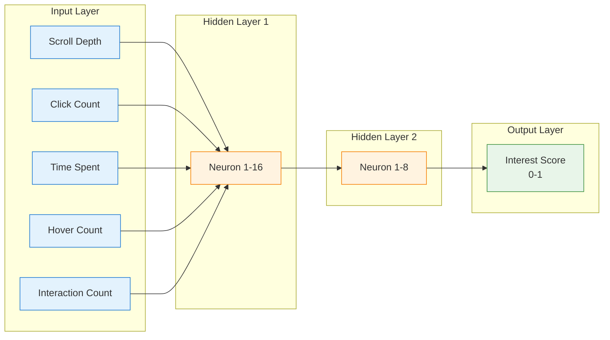
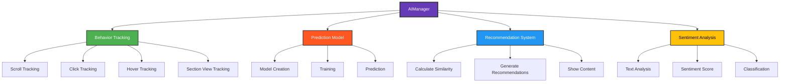
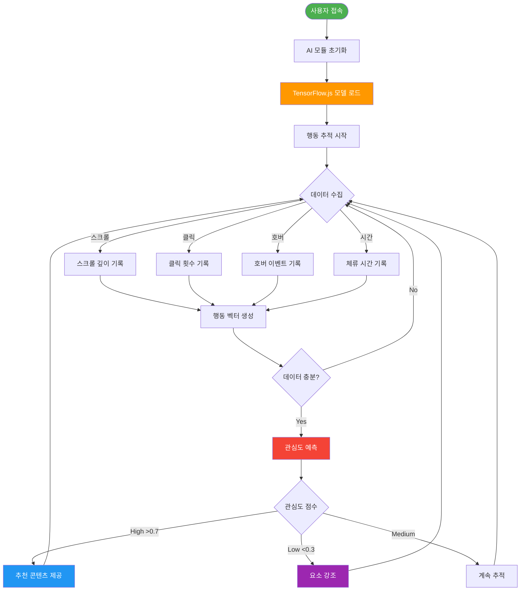
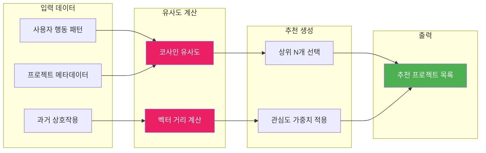
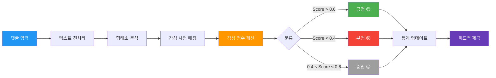
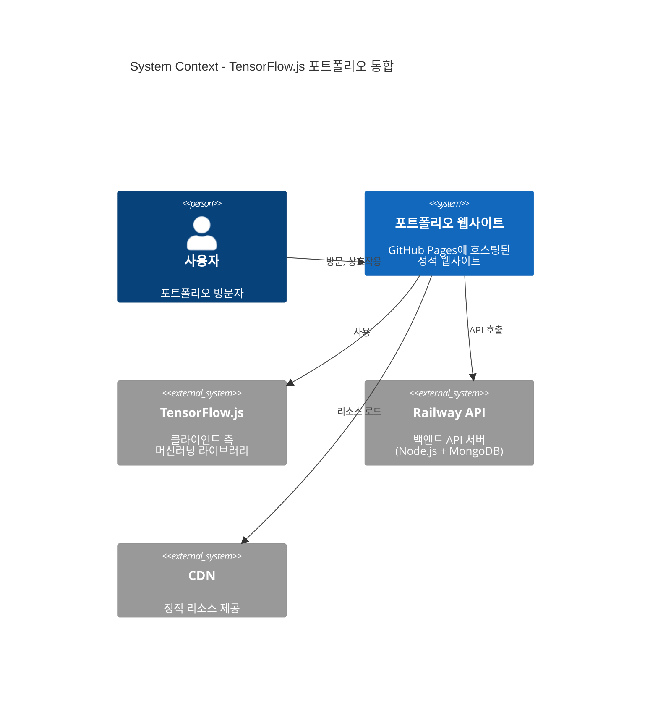
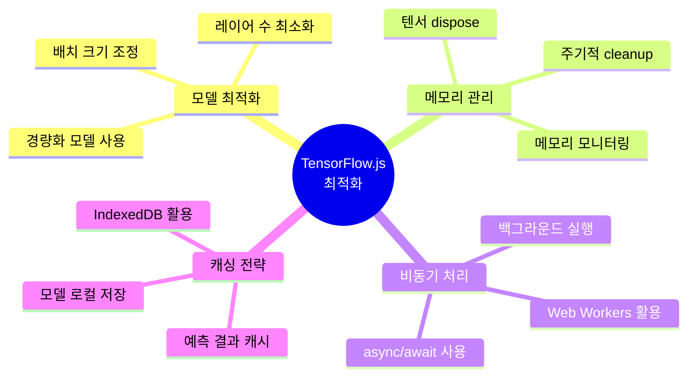
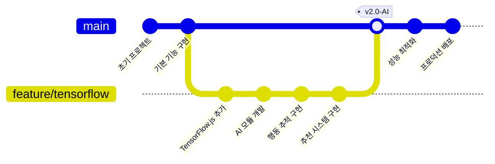

# TensorFlow.js 연동 아키텍처

## 시스템 아키텍처 다이어그램

## 데이터 흐름 다이어그램

## 신경망 모델 구조

## 기능 모듈 구조

## 사용자 행동 분석 프로세스

## 프로젝트 추천 알고리즘

## 실시간 감성 분석 파이프라인

## 시스템 통합 아키텍처

## 성능 최적화 전략

## 배포 및 모니터링

---

## 주요 특징

### 1. 실시간 사용자 행동 분석
- 스크롤 깊이, 클릭, 호버 등 5가지 행동 패턴 추적
- 5초마다 데이터 수집 및 분석
- 관심도 점수 실시간 예측

### 2. 지능형 추천 시스템
- 프로젝트 간 유사도 계산
- 사용자 행동 기반 맞춤형 추천
- 관심도에 따른 동적 UI 조정

### 3. 감성 분석
- 댓글 텍스트의 감성 분류
- 긍정/부정/중립 판별
- 실시간 피드백 제공

### 4. 경량화된 신경망
- Sequential 모델 (3개 레이어)
- 총 파라미터: 약 200개
- 브라우저에서 즉시 실행 가능

---

## 기술 스택

- **TensorFlow.js 4.15.0**: 클라이언트 측 머신러닝
- **Sequential Model**: 간단하고 효율적인 신경망
- **ReLU Activation**: 은닉층 활성화 함수
- **Sigmoid Activation**: 출력층 (0~1 확률)
- **Adam Optimizer**: 최적화 알고리즘
- **Binary Crossentropy**: 손실 함수
